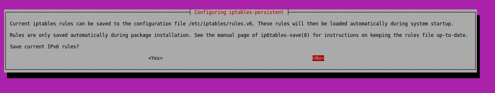
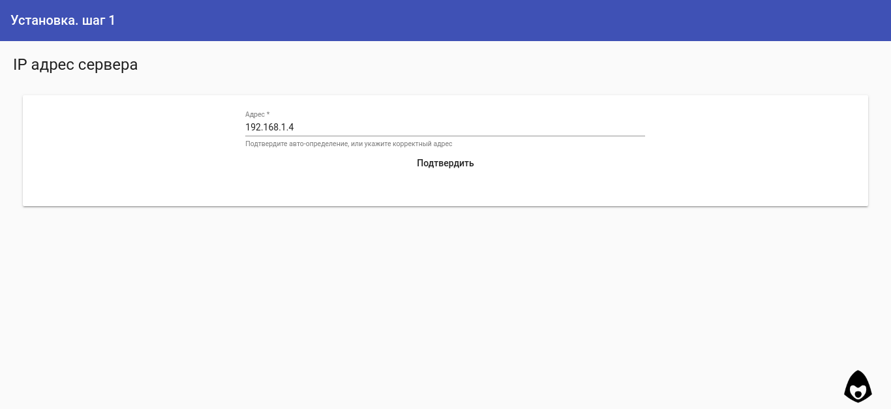
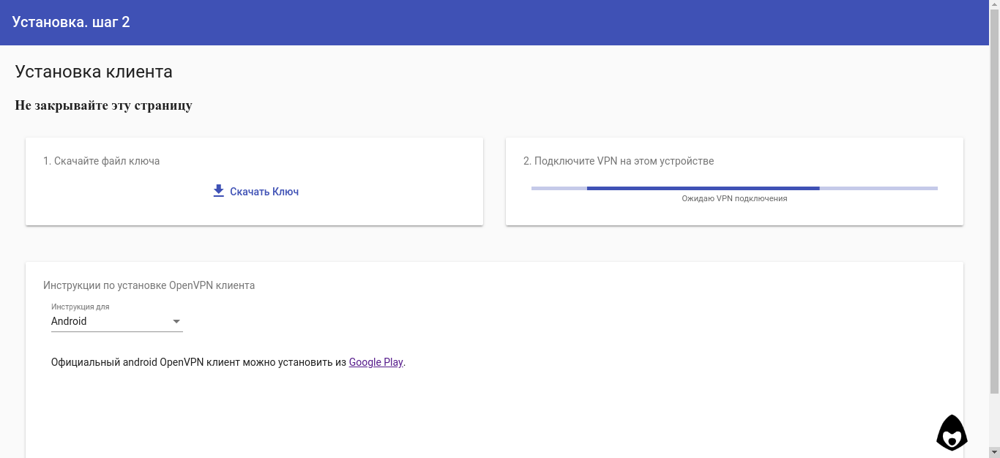
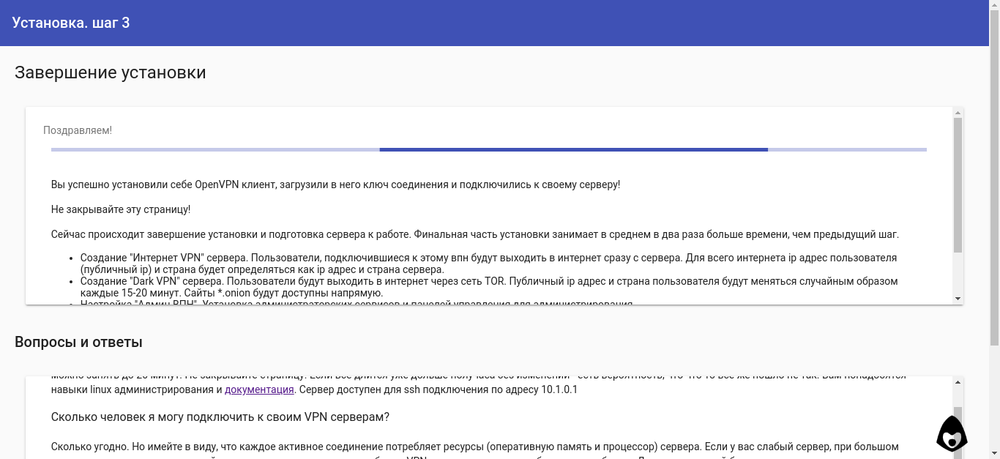

Установка
=========

Системные требования
--------------------

Для простой установки требуется OS Ubuntu/Debian, root доступ, доступ в интернет, однако обязательные зависимости проекта - это ``iptables-persistent``, ``tor``, ``nodejs``, ``easy-rsa``, ``openvpn``. Таким образом в режиме *ручной установки* систему можно установить на любое устройство-систему, поддерживающие необходимые пакеты.

.. _def_install:

Простая установка (по умолчанию)
--------------------------------

Простая установка расчитана на быстрое разворачивание минимальной впн инфрастуктуры на чистом сервере. Процесс разделён на несколько шагов, для гарантии выполнения каждого предыдущего.

Старт
~~~~~

После ssh подключения, используйте скрипт установки через wget

``wget -qO- https://raw.githubusercontent.com/abrakadobr/vpnface_lite/v1.0.1/install.sh | bash``

или curl

``curl -o- https://raw.githubusercontent.com/abrakadobr/vpnface_lite/v1.0.1/install.sh | bash``

Скрипт устанавливает пакеты ``iptables-persistent``, ``easy-rsa``, ``openvpn``, ``git``, ``tor`` и ``nginx`` из системных репозиториев, после чего устанавливает ``node version manager`` и через него устанавливает ``nodejs v10`` и пакеты ``forever`` и ``forever-service``. Скрипт клонирует репозиторий проекта, запускает в нём установку зависимостей ``npm``, устанавливает сервис *vpnface_lite* и стартует его.

По умолчанию скрипт клонирует файлы проекта в ``/opt/vpnface_lite`` и хранит данные по пути ``/opt/vpnface_ca``.

Во время установки выйдут 2 вопроса от пакета ``iptables-persistent`` о сохранении текущих настроек. Если у вас чистый сервер без каких-либо предварительных настроек - на оба можно ответить ``NO`` - в дальнейшем установка автоматически обновит и сохранит конфигурации. Если у вас сервер имеет какие-то настройки ``iptables`` - заранее позаботьтесь о их сохранности.

По завершению стартовых действия скрипт выводит приглашение завершить установку через веб интерфейс.

.. _step_1:

Шаг 1
~~~~~

Веб интерфейс запрашивает у пользователя публичный ip-адрес сервера. Скрипт установки пытается определяет адрес для автоматической подстановки через данные http запроса к веб-интерфейсу. После подтверждения ip адреса, скрипт через консоль (``ip -4 -o address``) ищет интерфейс с указаным айпи адресом и сохраняет сетевые данные в json файл ``ip.json``.

Далее создаётся Административный VPN сервер, и инсталлятор переходит на следующий шаг:

Шаг 2
~~~~~

На втором шаге веб установки пользователю предлагается создать ключ для подключения к Административному VPN серверу.

.. image:: ./_static/install2-1.png
   :alt: Создание vpn ключа

После чего инсталятор переходит в режим ожидания VPN подключения, предлагая пользователю скачать и установить OpenVPN клиент, и созданный на предыдущем шаге ключ соединения.

В это время скрипт зацикленно делает ``jsonp`` запрос на адрес ``http://10.1.0.1/api/ping`` ожидая ответа, пока пользователь устанавливает и подключает VPN. Когда ответ успешно получен, скрипт автоматически переходит к следующему шагу по внутреннему vpn адресу ``http://10.1.0.1:8808``

Шаг 3
~~~~~

При первом переходе по внутреннему адресу, скрипт автоматически запускает завершение установки.

Устанавливаются Интернет VPN и Dark VPN сервера, конфигурируются ``tor`` и ``nginx``. Настраивается файрвол ``iptables``, и так как на этом этапе мы уже уверены, что пользователь успешно подключился через администраторский vpn, на уровне ``iptables`` сервер закрывается от любого внешнего доступа, кроме трёх впн портов и конфигурация файрвола сохраняется с помощью ``iptables-persistent`` пакета.

По завершению всех действий пользователь автоматически редиректится в основную панель управления по адресу ``http://10.1.0.1``.

.. _hlf_install:

Установка с настройкой сертификатов или путей
~~~~~~~~~~~~~~~~~~~~~~~~~~~~~~~~~~~~~~~~~~~~~

 Один из случаев полу-автоматической установки - установка на чистый сервер, с необходимостью настроить данные сертификации или пути установки. В этом случае достаточно выполнить следующие шаги:

  * скачать файлы проекта ``git clone https://github.com/abrakadobr/vpnface_lite.git /etc/vpnface_lite``
  * отредактировать файл ``/etc/vpnface_lite/install.sh`` с указанием необходимого пути установки и отключения выкачивания файлов
  * отредактировать файл ``/etc/vpnface_lite/conf.js`` с указанием необхомого пути корневой директории данных, и данных сертификатов (:ref:`config_conf`)
  * после редактирования запустить файл ``/etc/vpnface_lite/install.sh`` и продолжить простую установку (:ref:`step_1`)

.. _man_install:

Ручная установка
----------------

В случае, если конфигурация автоматической установки не устраивает, существует несколько возможных путей конфигурации. Помимо скачивания файлов проекта для полноценной работы системы требуется:

 * Установить и настроить пакет ``tor`` (:ref:`config_tor`)
 * При необходимости установить и настроить пакет ``nginx`` (:ref:`config_nginx`)
 * Установить ``NodeJS v10`` (:ref:`nodejs_info`)
 * Если необходимо, создать и настроить службу ``vpnface_lite`` для файла ``vpnface_lite/server.js`` (:ref:`service_info`)
 * Настроить файрвол ``iptables/ufw/other`` на правильную маршрутизацию трафика и доступы (:ref:`iptables_info`)

.. _pnl_install:

Установка панели управления на работающий сервер
~~~~~~~~~~~~~~~~~~~~~~~~~~~~~~~~~~~~~~~~~~~~~~~~

Другой случай, в котором автоматическая настройка системы может не подойти - это подключение панели управления ключами к существующим и уже работающим OpenVPN серверам, или установка системы на уже работающий в определённой конфигурации сервер. В этом случае шаги будут следующие:

  * скачать файлы проекта ``git clone https://github.com/abrakadobr/vpnface_lite.git`` в необходимую директорию
  * отредактировать файл ``vpnface_lite/conf.js`` с указанием необхомого пути корневой директории данных, данные сертификатов и серверов в этом случае не имеют накакого значения. (:ref:`config_conf`)
  * настроить директорию данных по стуктуре VPNFace Lite. (:ref:`data_dir`)
  * дополнить easy-rsa скрипты для корректной блокировки-разблокировки ключей (:ref:`ca_dir`)
  * при необходимости, перенастроить OpenVPN сервера, с указанием порта менеджмента (:ref:`config_openvpn`)
  * создать файл ``ip.json`` в папке данных с описанием сетевой стуктуры. (:ref:`config_ip`)
  * создать файл ``servers.json`` в папке данных с описанием серверов (:ref:`config_servers`)
  * настроить проксирование веб-панели управления с порта 8808 на необходимые. (:ref:`config_nginx`)
  * установить ``nodejs 10+`` и настроить запуск сервера по необходимости в виде службы, или как-то ещё. (:ref:`service_info`)

VPNFace при старте проверяет установку по файлам ``ip.json`` и ``servers.json``, и в зависимости от этого переходит в режим установки или обычной работы. Таким образом, создание этих файлов с корректными данными позволит пропустить автоматическую установку, и запустить систему в рабочем режиме. Подробную информацию о \*.json файлах, структуре директорий и дополнительных скриптах смотрите в разделе :doc:`./tech`
