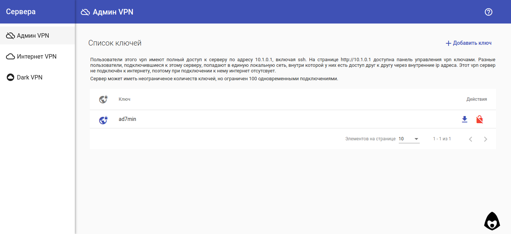

Использование
=============

VPN сервера
-----------

VPN соединение - шифрованное соединение напрямую между клиентом и сервером. Такие *сетевые туннели* позволяют связать пользователей из разных геолокаций планеты и интернет операторов в общую защинённую от доступа "из-вне" сеть.

По умолчанию, VPNFace Lite создаёт три OpenVPN сервера для различных задач:

Админ VPN
~~~~~~~~~

VPN предназначен для обеспечения безопасности серверного администрирования, поэтому он не подключён к общей интернет сети, и при подключении с установками клиента по умолчанию - у клиента отсутсвует доступ в интернет.

В этой vpn подсети (10.1.0.0/24) сервер полностью доступен по адресу 10.1.0.1

``ssh 10.1.0.1`` для ssh соединения, ``http://10.1.0.1`` - для доступа в панель управления ключами, ``http://10.1.0.1:81`` - докментация.

Интернет VPN
~~~~~~~~~~~~

VPN предназначен для доступа в общий интернет через сервер. Это позволяет держать зашифрованными все данные между клиентом и сервером, и подменяет "интернет публичные" данные клиента данными сервера, так как расшифрованый интернет трафик в *публичный интернет* выходит уже с сервера.

DNS запросы пользователя отправляются на публичные Google DNS 8.8.8.8 и 8.8.4.4

Dark (TOR) VPN
~~~~~~~~~~~~~~

Dark VPN *(англ. тёмный, чёрный)*, использует TOR даркнет для доступа в интернет. Пользовательский трафик проходит шифровано до сервера через vpn туннель, откуда перенаправляется в TOR сеть. Перенаправляются так же и DNS запросы, поэтому любые \*.onion сайты работают автоматически, прозрачно для пользователя.

Настройка TOR по умолчанию описана в :ref:`config_tor`, ряд стран по умолчанию поставлен в блокированные в качестве выходных узлов.

Панель управления ключами
-------------------------

Панель упрощена до минимума, и позволяет создавать, блокировать и разблокировать клиентские ключи, а так же скачивать готовую конфигурацию в виде ovpn файла. 

Панель написана на ``AngularJS 6``, представляет из себя веб приложение для использования vpnface_lite api endpoints и идёт по умолчанию в комплекте с серверными файлами в скомпилированном виде.

Исходные коды так же доступны в отдельном репозитории https://github.com/abrakadobr/vpnface_lite_ng.git

JSON API
--------

VPNFace Lite предоставляет набор json api endpoints котрые могут быть использованы отдельно, без панели управления через http запросы.

Endpoints, использующиеся при установке:

===== ================= ================================================
GET   /api/logs         получить последние логи
GET   /api/status       текущий статус.
GET   /api/finilize     запустить завершение установки
POST  /api/confirmip    установить ip и стартовать установку POST:ip
JSONP /api/ping         во время установки подтверждает подключение vpn
===== ================= ================================================

Endpoints, использующиеся при работе:

===== ================= ==================================================
GET   /api/logs         получить последние логи
GET   /api/status       текущий статус.
GET   /api/ovpn/:key    скачать ovpn ключ
POST  /api/gencli       создать новый ключ POST:srv, POST:cli key=cli@srv
GET   /api/lock/:key    заблокировать ключ
GET   /api/unlock/:key  разблокировать ключ
GET   /api/vpnlist      полный список серверов (файл servers.json)
GET   /api/server/:code полная информация о отдельном сервере
===== ================= ==================================================

параметр ``:code`` - код сервера <S> (:ref:`data_dir`)

параметр ``:key`` - составная строка вида ``client@server``. к примеру для клиентского ключа ``admin`` с сервера ``adm`` параметр ``:key`` будет равен ``admin@adm``
